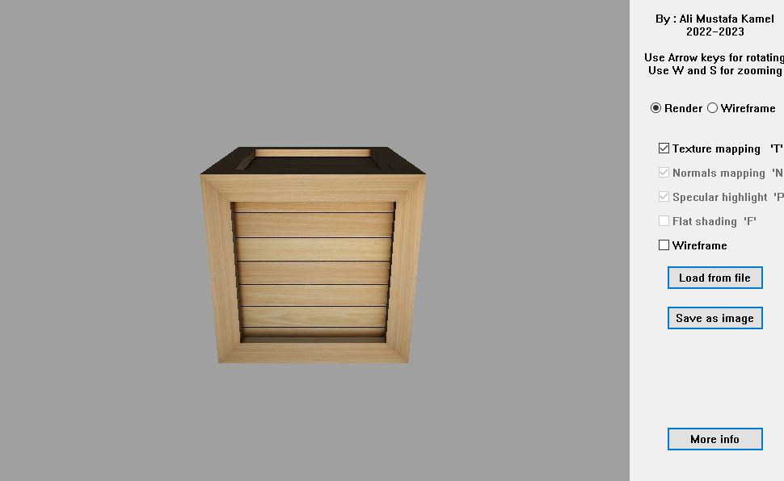

# AMK-Renderer
Basic 3D Software Renderer written in pure C++

the goal was to do everything from scratch, by manuplating the pixels directly.  

### Features :
- basic 3D Rendering pipeline.  
- UV, Texture and Normals mapping.  
- specular highlighting.  
- limited support for loading **.obj** file format :  
  - the program uses custom commands written to **.obj files** to specify textures and other things.  
  - the program can only process **Tri** and **Quad** faces, no support for **multi-vertex** faces.  
- saving the render to an image.  

download from [here](https://mega.nz/file/YR1C2RQT#D1NAnhoY5KbOAIfsM1NPFcCijdGZTBFmiOwPY41xe1w).

### Preview

